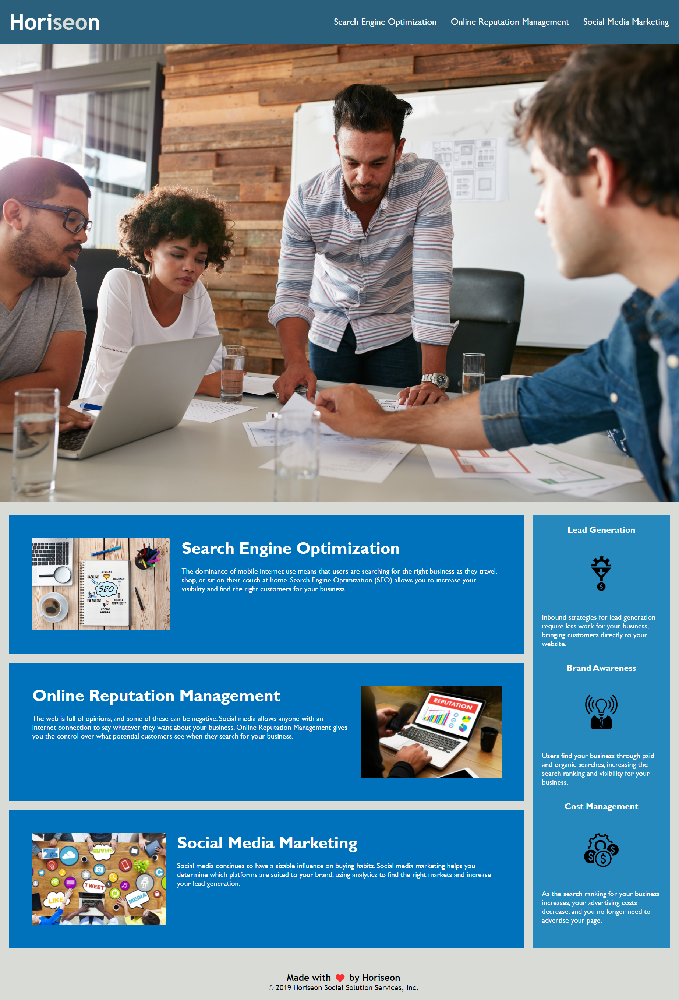

# accessibility-refactor

## Description

This assignment asked us to take existing code and refactor it, improving not only the site's accessibility, but also its efficiency and organization.

Doing this project I learned a lot about the different types of semantic html tags, as well as the importance of clean and concise CSS selectors. The original code was written using only generic div containers, and had a lot of redundant CSS selectors. To refactor the code I applied semantic html labels such as **nav** and **header** to assist with screen reader accessibility, while also consolidating multiple CSS classes that did the same thing into one.

All of these edits increased the site's accessibility, efficiency, and search engine optimization.

## Links

- [Deployed Webpage](https://i-moss.github.io/hw-1-refactor/ "Deployed Webpage")

## Screenshot

